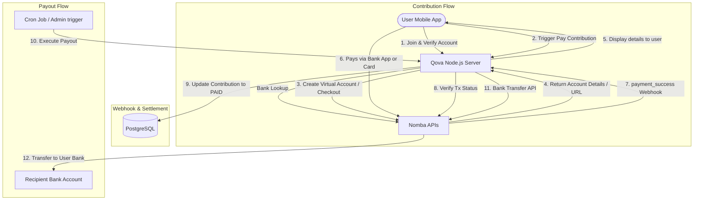

# Qova × Nomba Hackathon 2026 Research Report

This document outlines the strategic research, technical alignment, and transition plan for adapting **Qova** (a digital Ajo/ROSCA community finance platform) for submission to the **DevCareer × Nomba Hackathon 2026**.

---

## 1. Hackathon Overview & Strategy

The DevCareer × Nomba Hackathon is a 5-week virtual challenge centered around building high-impact payment solutions for the African market using Nomba’s payment infrastructure.

### Core Hackathon Details
* **Registration Period:** June 8 – June 21, 2026
* **Hackathon Duration:** June 8 – July 18, 2026
* **Prize Pool:** $6,500
  * **1st Place:** $4,000
  * **2nd Place:** $1,500
  * **3rd Place:** $1,000
* **Location:** Fully Virtual
* **Official Portal:** [DevCareer Nomba Hackathon](https://devcareer.io/programs/nomba-hackathon)

### Strategic Alignment: The "Build Track"
The hackathon divides submissions into the **Build Track** (merchant-ready or customer-facing payment platforms) and the **Infrastructure Track** (payment primitives). 

**Qova** aligns perfectly with the **Build Track**:
1. **Target Market Fit:** Addresses the massive informal community finance space in Nigeria (Ajo/ROSCA), moving paper-and-handshake groups online.
2. **Deep Nomba Integration:** Replaces the generic Paystack abstraction with a suite of Nomba-specific products:
   - **Nomba Checkout** for instant debit card/USSD contribution payments.
   - **Nomba Dynamic Virtual Accounts** for bank transfer collections (the most preferred payment method in Nigeria).
   - **Nomba Bank Transfers** for automatic end-of-cycle payouts to pot recipients.
   - **Nomba Bank Account Lookup** to verify member identities during profile creation.

---

## 2. API Comparison: Paystack vs. Nomba

Qova's initial design draft (referenced in `PROJECTS.md`) specified Paystack for collections and payouts. Below is the transition plan mapping Paystack integrations to Nomba's API infrastructure:

| Feature / User Action | Current Paystack Design | Proposed Nomba Integration | Nomba Endpoint / Method |
| :--- | :--- | :--- | :--- |
| **API Authentication** | Simple Bearer Secret Key | OAuth2 Client Credentials (caching JWT) | `POST /v1/auth/token/issue` |
| **Member Verification** | Resolve Bank Account | Bank Account Lookup | `POST /v1/transfers/bank/lookup` |
| **Initiate Contribution Payment** | Paystack Inline (SDK/WebView) | Nomba Checkout Order | `POST /v1/checkout/order` |
| **Alternative Contribution Method** | USSD / Transfer via Paystack | Nomba Dynamic Virtual Accounts | `POST /v1/accounts/virtual` |
| **Automated Circle Payout** | Paystack Transfers API | Nomba Bank Transfer API | `POST /v2/transfers/bank` |
| **Payment Verification** | Webhook + Transaction Verification | Webhook (`payment_success`) + Single Tx Query | `GET /v1/transactions/accounts/single` |

---

## 3. Technical Integration Specifications

To integrate Nomba, we will build a core `NombaService` in Qova's Node.js backend. Below are the specific payloads and endpoints required to adapt Qova's endpoints:

### A. OAuth2 Authentication Flow
Nomba uses OAuth2 client credentials. Since access tokens expire in 30 minutes, the backend must implement a token manager with in-memory caching and automatic refresh.

> [!TIP]
> **Instant Sandbox (No Account Required):** For prototyping and initial sandbox integration, you do not need an account, bearer token, or `accountId`. Simply send requests to the Sandbox base URL (`https://sandbox.nomba.com`) and omit the `Authorization` and `accountId` headers. The sandbox will automatically process the requests and return standard mock responses.

* **Endpoint:** `POST /v1/auth/token/issue` (sandbox: `https://sandbox.nomba.com/v1/auth/token/issue`)
* **Headers:** 
  * `accountId: <YOUR_ACCOUNT_ID>`
* **Request Body:**
  ```json
  {
    "grant_type": "client_credentials",
    "client_id": "YOUR_CLIENT_ID",
    "client_secret": "YOUR_CLIENT_SECRET"
  }
  ```
* **Response:**
  ```json
  {
    "access_token": "eyJhbGciOi...",
    "refresh_token": "rf_...",
    "expires_in": 1800,
    "token_type": "Bearer"
  }
  ```

### B. Member Profile Bank Account Verification
Before a user can join a circle or receive payouts, their account must be validated.
* **Endpoint:** `POST /v1/transfers/bank/lookup`
* **Request Body:**
  ```json
  {
    "accountNumber": "0554772814",
    "bankCode": "058"
  }
  ```
* **Response:**
  ```json
  {
    "success": true,
    "data": {
      "accountName": "M.A Animashaun",
      "accountNumber": "0554772814",
      "bankCode": "058"
    }
  }
  ```

### C. Savings Circle Contribution (Collections)

#### Option 1: Nomba Checkout (Mobile WebView integration)
When a user clicks "Pay Now" on their mobile app:
1. Backend calls `POST /v1/checkout/order` to create a payment link.
2. Mobile client displays the Checkout URL inside a WebView.
3. User completes the payment; Nomba redirects them back and triggers webhooks.

* **Endpoint:** `POST /v1/checkout/order`
* **Headers:** Include Bearer access token and `accountId`.
* **Request Body:**
  ```json
  {
    "order": {
      "amount": "50000.00",
      "currency": "NGN",
      "orderReference": "contrib-ref-uuid-001",
      "callbackUrl": "https://api.qova.app/contributions/verify-callback",
      "customerEmail": "user@example.com",
      "allowedPaymentMethods": ["Card", "Transfer", "USSD"],
      "orderMetaData": {
        "circleId": "circle-uuid-abc",
        "cycleNumber": 1,
        "userId": "user-uuid-123"
      }
    }
  }
  ```
* **Response:**
  ```json
  {
    "success": true,
    "data": {
      "orderReference": "contrib-ref-uuid-001",
      "checkoutLink": "https://checkout.nomba.com/pay/contrib-ref-uuid-001",
      "amount": "50000.00"
    }
  }
  ```

#### Option 2: Dynamic Virtual Accounts (The Premium Ajo UX)
For a frictionless experience, Qova can generate a **dynamic virtual bank account** for each circle contribution slot. The member simply makes a transfer from their banking app (GTBank, Zenith, Kuda, etc.) to the virtual account shown in the app.

* **Endpoint:** `POST /v1/accounts/virtual`
* **Request Body:**
  ```json
  {
    "accountRef": "qova-contrib-slot-001",
    "accountName": "Qova Ajo - [Circle Name]",
    "expiryDate": "2026-06-12 18:00:00",
    "expectedAmount": "50000.00"
  }
  ```
* **Response:**
  ```json
  {
    "success": true,
    "data": {
      "accountNumber": "9912345678",
      "bankName": "Wema Bank (Nomba)",
      "accountRef": "qova-contrib-slot-001",
      "expiryDate": "2026-06-12 18:00:00"
    }
  }
  ```

### D. Automated Pot Payouts
At the end of a cycle, once all contributions are collected, Qova uses Nomba Transfers to disburse the full pot to the slot recipient.
* **Endpoint:** `POST /v2/transfers/bank`
* **Request Body:**
  ```json
  {
    "amount": 500000, 
    "accountNumber": "0554772814",
    "accountName": "M.A Animashaun",
    "bankCode": "058",
    "merchantTxRef": "payout-ref-uuid-999",
    "senderName": "Qova Savings",
    "narration": "Ajo Circle Payout - Cycle 1"
  }
  ```
* **Response:**
  ```json
  {
    "success": true,
    "data": {
      "transferReference": "nomba-tx-992384",
      "status": "PENDING"
    }
  }
  ```

---

## 4. Qova Architecture Transition Map



---

## 5. Qova Development Roadmap for Hackathon Submission

To build a winning submission by **July 18, 2026**, the development workflow is organized as follows:

### Phase 1: Environment & Authentication (Days 1–3)
- Set up Nomba Sandbox Developer Account.
- Implement the authentication service (`server/src/services/nomba.ts`) with a token caching manager.
- Map the environment variables (`NOMBA_CLIENT_ID`, `NOMBA_CLIENT_SECRET`, `NOMBA_ACCOUNT_ID`, `NOMBA_BASE_URL`).

### Phase 2: Bank Account Lookup & Profile Onboarding (Days 4–7)
- Un-comment and build `/users/me` and `/auth/complete-profile` endpoints.
- Integrate the Bank Account Lookup endpoint into profile registration to verify bank details upfront.
- Enable selection from Nomba's supported bank list.

### Phase 3: Circle Contributions via Nomba Checkout & Virtual Accounts (Days 8–15)
- Implement `/contributions/pay` backend controller using **Nomba Checkout**.
- Update the React Native app using `react-native-webview` to open Nomba's `checkoutLink`.
- Implement **Nomba Dynamic Virtual Accounts** for direct-transfer contribution options.
- Build the webhook receiver endpoint `/contributions/verify` to receive payments and update contribution statuses.

### Phase 4: Admin Dashboard & Payout Engine (Days 16–22)
- Build the payout service to trigger Nomba bank transfers.
- Enable automated cycle progression on the backend when all contributions are marked `PAID`.
- Handle failure states (e.g. transfer failures, retry queues) to protect group funds.

### Phase 5: Testing, Audits & Polish (Days 23–28)
- Test sandbox webhooks, late payment scoring adjustments, and bank payouts.
- Polish mobile UI transitions and the "Ajo Circle" progress dashboard.
- Verify error monitoring using Sentry.

### Phase 6: Submission Preparation (Days 29–35)
- Record a premium demo video highlighting how Nomba powers community thrift in Nigeria.
- Write a compelling submission readme with clear API highlights.
